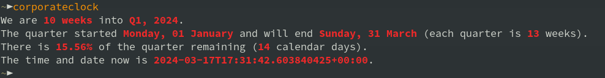

# corporateclock

It tells you where you are in the year/quarter.



## Usage

```{bash}
$ corporateclock
```

## Install

Providing your `~/bin` is added to your `PATH` correctly:

```{bash}
$ cargo build --release
$ cp ./target/release/corporateclock ~/bin
```

otherwise;

```{bash}
$ cargo run
```